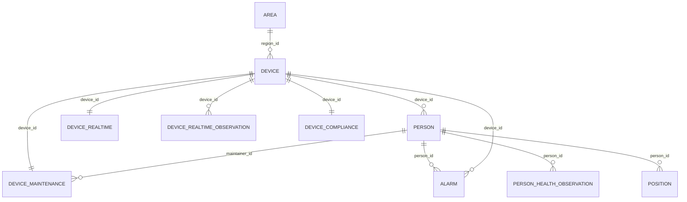

# PetroShield 数据库表结构

本文档记录当前 Supabase 初始化迁移中的核心表结构，来源于：

- `database/supabase/migrations/20260710000100_init_core_tables.sql`
- `database/supabase/migrations/20260712000200_add_person_health_observation.sql`
- `database/supabase/migrations/20260712000300_add_device_realtime_observation.sql`
- 需求分析文档中的 `person`、`alarm`、`position`、`area`、`device` 原型

后续约定：生成迁移文件或 seed 文件后，默认只提交到本地文件，不直接执行 `supabase db push`。

## 总览

当前数据库围绕厂区安全监管场景设计，核心对象如下：

| 表名 | 说明 |
| --- | --- |
| `area` | 电子围栏、风险区域、作业区域 |
| `device` | 设备基础档案 |
| `device_realtime` | 设备实时状态 |
| `device_realtime_observation` | 设备实时状态历史观测及最新快照来源 |
| `device_maintenance` | 设备运维管理 |
| `device_compliance` | 设备合规年检 |
| `person` | 厂区人员基础信息、状态、培训、健康与安全行为 |
| `person_health_observation` | 人员健康字段历史观测及最新快照来源 |
| `alarm` | 告警事件 |
| `position` | 人员实时与历史定位 |

## 关系图



## 通用约定

- 主键当前统一使用 `text`，默认值为 `extensions.gen_random_uuid()::text`。这样既支持系统自动生成 UUID，也能兼容外部设备编码、人员编码、区域编码。
- JSON 字段使用 `jsonb`，包括区域边界、中心点、设备位置、告警位置、告警证据。
- 时间字段使用 `timestamptz`。
- 文档原型中的 `string` 映射为 `text`，`float` 映射为 `double precision`，`datetime` 映射为 `timestamptz`，`json` 映射为 `jsonb`。
- `update_time` 和 `updated_at` 通过触发器自动刷新。

## area

定义电子围栏与风险区域。

| 字段 | 类型 | 约束/默认值 | 说明 |
| --- | --- | --- | --- |
| `id` | `text` | PK, default UUID text | 区域唯一标识 |
| `name` | `text` | NOT NULL | 区域名称 |
| `type` | `text` | NOT NULL | 区域类型，如禁入、限制、普通、危险 |
| `polygon` | `jsonb` | NOT NULL, default `[]` | 多边形坐标集合 |
| `center` | `jsonb` | NULL | 中心点坐标 |
| `radius` | `double precision` | NULL, `radius >= 0` | 半径，适用于圆形区域 |
| `rule_config` | `jsonb` | NOT NULL, default `{}` | 规则配置，如越界、停留、人数限制 |
| `risk_level` | `text` | NULL | 风险等级 |
| `enable` | `boolean` | NOT NULL, default `true` | 是否启用 |
| `create_time` | `timestamptz` | NOT NULL, default `now()` | 创建时间 |
| `update_time` | `timestamptz` | NOT NULL, default `now()` | 更新时间 |

索引：

- `idx_area_type_enable(type, enable)`

## device

设备基础信息层，管理定位设备、感知设备、生产设备和安防设备的基础档案。

| 字段 | 类型 | 约束/默认值 | 说明 |
| --- | --- | --- | --- |
| `id` | `text` | PK, default UUID text | 设备唯一 ID |
| `name` | `text` | NOT NULL | 设备名称 |
| `type` | `text` | NOT NULL | 设备类型，如 UWB、北斗、雷达、摄像头、泵、仪表 |
| `category` | `text` | NOT NULL | 分类，如感知设备、生产设备、安防设备 |
| `model` | `text` | NULL | 设备型号 |
| `manufacturer` | `text` | NULL | 厂商 |
| `serial_number` | `text` | NULL | 序列号 |
| `install_date` | `timestamptz` | NULL | 安装时间 |
| `region_id` | `text` | FK -> `area(id)`, ON DELETE SET NULL | 所属区域 |
| `location` | `jsonb` | NULL | 安装位置，如厂区、车间、GIS 坐标 |
| `created_at` | `timestamptz` | NOT NULL, default `now()` | 创建时间 |
| `updated_at` | `timestamptz` | NOT NULL, default `now()` | 更新时间 |

索引：

- `idx_device_region_id(region_id)`

## device_realtime

设备实时状态层。和 `device` 一对一，用于承载频繁变化的在线状态、心跳、健康度等数据。

| 字段 | 类型 | 约束/默认值 | 说明 |
| --- | --- | --- | --- |
| `device_id` | `text` | PK, FK -> `device(id)`, ON DELETE CASCADE | 关联设备 |
| `status` | `text` | NOT NULL | online / offline / fault / maintenance |
| `battery` | `double precision` | NULL, 0 到 100 | 电量 |
| `signal_strength` | `double precision` | NULL | 信号强度 |
| `cpu_usage` | `double precision` | NULL, 0 到 100 | CPU 使用率 |
| `temperature` | `double precision` | NULL | 设备温度 |
| `last_heartbeat` | `timestamptz` | NULL | 最后心跳 |
| `health_score` | `double precision` | NULL, 0 到 100 | 健康评分 |
| `updated_at` | `timestamptz` | NOT NULL, default `now()` | 更新时间 |

索引：

- `idx_device_realtime_status(status)`

## device_realtime_observation

保存 `device_realtime` 相同业务字段的历史版本。每次观测变化后，触发器会选择该设备时间最新的一条同步到 `device_realtime`；删除最新记录时自动回退到上一条。

| 字段 | 类型 | 约束/默认值 | 说明 |
| --- | --- | --- | --- |
| `id` | `text` | PK, default UUID text | 状态观测唯一标识 |
| `device_id` | `text` | NOT NULL, FK -> `device(id)`, ON DELETE CASCADE | 关联设备 |
| `observation_time` | `timestamptz` | NOT NULL | 状态观测时间 |
| `status` | `text` | NOT NULL | online / offline / fault / maintenance |
| `battery` | `double precision` | NULL, 0 到 100 | 电量 |
| `signal_strength` | `double precision` | NULL | 信号强度 |
| `cpu_usage` | `double precision` | NULL, 0 到 100 | CPU 使用率 |
| `temperature` | `double precision` | NULL | 设备温度 |
| `last_heartbeat` | `timestamptz` | NULL | 最后心跳 |
| `health_score` | `double precision` | NULL, 0 到 100 | 健康评分 |
| `created_at` | `timestamptz` | NOT NULL, default `now()` | 创建时间 |
| `updated_at` | `timestamptz` | NOT NULL, default `now()` | 更新时间 |

约束和索引：

- `unique(device_id, observation_time)`
- `idx_device_realtime_observation_device_time(device_id, observation_time desc)`
- `idx_device_realtime_observation_time_status(observation_time desc, status)`

## device_maintenance

设备运维管理层。和 `device` 一对一，责任人来自 `person`。

| 字段 | 类型 | 约束/默认值 | 说明 |
| --- | --- | --- | --- |
| `device_id` | `text` | PK, FK -> `device(id)`, ON DELETE CASCADE | 设备 ID |
| `maintainer_id` | `text` | NOT NULL, FK -> `person(id)`, ON DELETE RESTRICT | 责任人 |
| `department` | `text` | NULL | 责任部门 |
| `maintenance_level` | `text` | NULL | 一级、二级、普通 |
| `inspect_cycle_days` | `integer` | NULL, `> 0` | 巡检周期 |
| `last_inspect_time` | `timestamptz` | NULL | 上次巡检 |
| `next_inspect_time` | `timestamptz` | NULL | 下次巡检 |
| `last_repair_time` | `timestamptz` | NULL | 最近维修 |
| `repair_count` | `integer` | NOT NULL, default `0`, `>= 0` | 维修次数 |
| `maintenance_status` | `text` | NULL | 正常、维修中、停用 |
| `remark` | `text` | NULL | 备注 |

索引：

- `idx_device_maintenance_maintainer_id(maintainer_id)`

## device_compliance

设备合规年检层。和 `device` 一对一，用于承载强检、年检、证书、检测机构等信息。

| 字段 | 类型 | 约束/默认值 | 说明 |
| --- | --- | --- | --- |
| `device_id` | `text` | PK, FK -> `device(id)`, ON DELETE CASCADE | 设备 ID |
| `inspection_required` | `boolean` | NOT NULL, default `false` | 是否强检设备 |
| `inspection_type` | `text` | NULL | 年检类型，如法检、自检 |
| `inspection_cycle_months` | `integer` | NULL, `> 0` | 年检周期 |
| `last_inspection_time` | `timestamptz` | NULL | 上次年检 |
| `next_inspection_time` | `timestamptz` | NULL | 下次年检 |
| `inspection_status` | `text` | NULL | pass / pending / expired |
| `inspection_agency` | `text` | NULL | 检测机构 |
| `certificate_no` | `text` | NULL | 检测证书编号 |
| `risk_level` | `text` | NULL | 高、中、低风险 |
| `updated_at` | `timestamptz` | NOT NULL, default `now()` | 更新时间 |

## person

厂区人员基础信息及设备绑定关系，同时包含状态、培训、健康管理、绩效与安全行为字段。

| 字段 | 类型 | 约束/默认值 | 说明 |
| --- | --- | --- | --- |
| `id` | `text` | PK, default UUID text | 人员唯一标识 |
| `name` | `text` | NOT NULL | 姓名 |
| `gender` | `text` | NULL | 性别 |
| `type` | `text` | NOT NULL | 人员类型，如员工、承包商、访客 |
| `department` | `text` | NULL | 所属部门 |
| `position` | `text` | NULL | 岗位 |
| `company` | `text` | NULL | 所属单位或承包商公司 |
| `id_card` | `text` | NULL | 身份证或工号 |
| `phone` | `text` | NULL | 联系方式 |
| `device_id` | `text` | FK -> `device(id)`, ON DELETE SET NULL | 绑定定位设备 ID |
| `device_type` | `text` | NULL | 设备类型，如 UWB、RFID、GPS、蓝牙 |
| `bind_time` | `timestamptz` | NULL | 绑定时间 |
| `location_zone` | `text` | NULL | 当前所属区域 |
| `status` | `text` | NOT NULL | 状态，如正常、异常、离线、风险、禁止进入 |
| `risk_level` | `text` | NULL | 风险等级 |
| `access_status` | `text` | NULL | 通行状态 |
| `last_active_time` | `timestamptz` | NULL | 最近活跃时间 |
| `safety_tag` | `text` | NULL | 安全标签 |
| `training_status` | `text` | NULL | 培训状态 |
| `training_score` | `double precision` | NULL, `>= 0` | 综合培训评分 |
| `last_training_time` | `timestamptz` | NULL | 最近培训时间 |
| `certificate_status` | `text` | NULL | 证书状态 |
| `health_status` | `text` | NULL | 健康状态 |
| `health_risk_level` | `text` | NULL | 职业健康风险等级 |
| `last_medical_check` | `timestamptz` | NULL | 最近体检时间 |
| `occupational_disease_flag` | `boolean` | NULL | 是否职业病风险人员 |
| `exposure_level` | `text` | NULL | 暴露等级 |
| `performance_score` | `double precision` | NULL, `>= 0` | 综合绩效评分 |
| `violation_count` | `integer` | NOT NULL, default `0`, `>= 0` | 安全违规次数 |
| `reward_count` | `integer` | NOT NULL, default `0`, `>= 0` | 安全奖励次数 |
| `near_miss_count` | `integer` | NOT NULL, default `0`, `>= 0` | 未遂事件上报次数 |
| `safety_score` | `double precision` | NULL, `>= 0` | 安全积分 |
| `create_time` | `timestamptz` | NOT NULL, default `now()` | 创建时间 |
| `update_time` | `timestamptz` | NOT NULL, default `now()` | 更新时间 |
| `remark` | `text` | NULL | 备注 |

索引：

- `idx_person_device_id(device_id)`
- `idx_person_type_status(type, status)`
- `idx_person_department(department)`

## person_health_observation

保存 `person` 表健康字段的历史版本。一个人员可以有多条观测；数据库触发器会按 `observation_time` 选择最新一条，并同步回 `person` 的健康快照字段。`location_zone` 只记录观测时的区域上下文，不参与回写人员当前位置。

| 字段 | 类型 | 约束/默认值 | 说明 |
| --- | --- | --- | --- |
| `id` | `text` | PK, default UUID text | 健康观测唯一标识 |
| `person_id` | `text` | NOT NULL, FK -> `person(id)`, ON DELETE CASCADE | 关联人员 |
| `observation_time` | `timestamptz` | NOT NULL | 观测记录或生效时间 |
| `health_status` | `text` | NULL | 与 `person.health_status` 一致 |
| `health_risk_level` | `text` | NULL | 与 `person.health_risk_level` 一致 |
| `last_medical_check` | `timestamptz` | NULL | 与 `person.last_medical_check` 一致 |
| `occupational_disease_flag` | `boolean` | NULL | 与 `person.occupational_disease_flag` 一致 |
| `exposure_level` | `text` | NULL | 与 `person.exposure_level` 一致 |
| `location_zone` | `text` | NULL | 观测时所在区域快照，与 `person.location_zone` 值域一致 |
| `create_time` | `timestamptz` | NOT NULL, default `now()` | 创建时间 |
| `update_time` | `timestamptz` | NOT NULL, default `now()` | 更新时间 |

约束和索引：

- `unique(person_id, observation_time)`
- `idx_person_health_observation_person_time(person_id, observation_time desc)`
- `idx_person_health_observation_time_zone(observation_time desc, location_zone)`

## alarm

系统产生的所有告警事件。

| 字段 | 类型 | 约束/默认值 | 说明 |
| --- | --- | --- | --- |
| `id` | `text` | PK, default UUID text | 告警唯一标识 |
| `type` | `text` | NOT NULL | 告警类型，如越界、跌倒、设备异常、识别异常 |
| `level` | `text` | NOT NULL | 告警等级，如一般、严重、重大 |
| `location` | `jsonb` | NOT NULL | 发生位置，坐标或区域 ID |
| `time` | `timestamptz` | NOT NULL | 发生时间 |
| `status` | `text` | NOT NULL | 状态，如新建、确认、处理中、关闭、误报 |
| `person_id` | `text` | FK -> `person(id)`, ON DELETE SET NULL | 关联人员 ID |
| `device_id` | `text` | FK -> `device(id)`, ON DELETE SET NULL | 关联设备 ID |
| `confidence` | `double precision` | NULL, 0 到 1 | AI 置信度 |
| `description` | `text` | NULL | 告警描述 |
| `evidence` | `jsonb` | NULL | 图片、视频、传感器证据 |
| `create_time` | `timestamptz` | NOT NULL, default `now()` | 创建时间 |
| `update_time` | `timestamptz` | NOT NULL, default `now()` | 更新时间 |

索引：

- `idx_alarm_person_id(person_id)`
- `idx_alarm_device_id(device_id)`
- `idx_alarm_status_time(status, time desc)`
- `idx_alarm_level_time(level, time desc)`

## position

人员实时及历史定位数据。

| 字段 | 类型 | 约束/默认值 | 说明 |
| --- | --- | --- | --- |
| `id` | `text` | PK, default UUID text | 定位记录 ID |
| `person_id` | `text` | NOT NULL, FK -> `person(id)`, ON DELETE CASCADE | 人员 ID |
| `x` | `double precision` | NOT NULL | X 坐标 |
| `y` | `double precision` | NOT NULL | Y 坐标 |
| `z` | `double precision` | NULL | Z 坐标 |
| `source` | `text` | NOT NULL | 数据来源，如北斗、UWB、视觉融合 |
| `confidence` | `double precision` | NOT NULL, 0 到 1 | 定位置信度 |
| `timestamp` | `timestamptz` | NOT NULL | 定位时间 |
| `speed` | `double precision` | NULL, `>= 0` | 移动速度 |
| `direction` | `double precision` | NULL | 移动方向 |
| `create_time` | `timestamptz` | NOT NULL, default `now()` | 入库时间 |

索引：

- `idx_position_person_timestamp(person_id, timestamp desc)`
- `idx_position_source_timestamp(source, timestamp desc)`

## Seed 数据

模拟数据文件位于：

- `database/supabase/seeds/seed.sql`
- `database/supabase/seeds/seed_alarms.sql`
- `database/supabase/seeds/seed_person_health.sql`
- `database/supabase/seeds/seed_device_realtime_observation.sql`
- `database/supabase/backfill_person_health_observation.sql`（远端一次性回填，不由 `db reset` 自动执行）

当前 seed 覆盖：

- 4 个区域
- 16 台设备
- 16 条设备实时状态
- 25 名人员
- 4 条设备运维记录
- 4 条设备合规年检记录
- 6 条基础告警
- 50 条最近 7 天的动态告警趋势数据
- 175 条最近 7 天的人员健康观测数据
- 112 条最近 7 天的设备实时状态观测数据
- 16 条定位记录

执行方式：

```bash
cd database
supabase db reset
```

如果只想推送迁移到远端，由你手动执行：

```bash
cd database
supabase db push --linked
```

如果确认要把 seed 数据也写入远端，由你手动执行：

```bash
cd database
supabase db push --linked --include-seed
```
