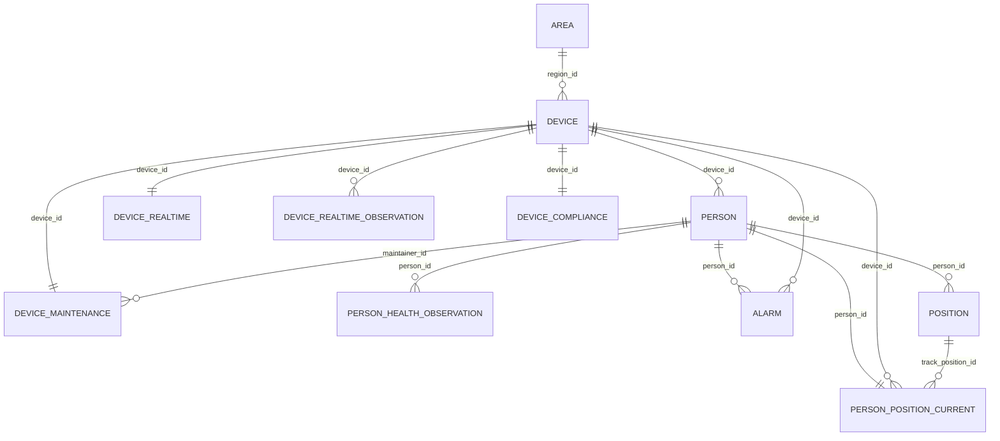

# PetroShield 数据库结构

> 最后核对：2026-07-13
> 来源：`database/supabase/migrations/` 中的 4 个迁移文件，以及当前 `database/supabase/seeds/` 策略。本文用于后续 Codex 快速理解 schema；字段、约束和触发器以迁移 SQL 为最终准绳。

## 1. 总览

当前 Supabase/PostgreSQL schema 除安全监管业务表外，还包含登录认证、角色权限和系统审计表：

| 表 | 说明 |
| --- | --- |
| `area` | 电子围栏、风险区域、作业区域 |
| `device` | 设备基础档案 |
| `device_realtime` | 设备实时状态快照 |
| `device_realtime_observation` | 设备实时状态历史观测，最新观测同步到 `device_realtime` |
| `device_maintenance` | 设备运维管理 |
| `device_compliance` | 设备合规、年检、证书 |
| `person` | 人员基础信息、状态、培训、健康、安全行为 |
| `person_health_observation` | 人员健康历史观测，最新观测同步回 `person` 健康字段 |
| `alarm` | 告警事件 |
| `position` | 人员短期轨迹点 |
| `person_position_current` | 人员实时位置快照，一人最多一条 |
| `system_user` | 平台登录账号与 bcrypt 密码哈希 |
| `system_role` | 平台角色 |
| `system_permission` | 细粒度权限定义 |
| `system_role_permission` | 角色权限关联 |
| `system_operation_log` | 登录及系统管理操作审计 |

通用约定：

- 主键基本使用 `text`，默认值多为 `extensions.gen_random_uuid()::text`。
- 时间字段使用 `timestamptz`。
- JSON 字段使用 `jsonb`。
- `create_time` / `update_time` 或 `created_at` / `updated_at` 是当前项目并存的两套命名。
- `set_update_time()` 更新 `update_time`；`set_updated_at()` 更新 `updated_at`。
- 不要擅自执行远端 `supabase db push` 或带 seed 的远端操作。

## 2. 关系图



## 3. 公共函数

### `public.set_update_time()`

`before update` 触发器函数，写入 `new.update_time = now()`。

当前用于：

- `area`
- `person`
- `alarm`
- `person_health_observation`

### `public.set_updated_at()`

`before update` 触发器函数，写入 `new.updated_at = now()`。

当前用于：

- `device`
- `device_realtime`
- `device_compliance`
- `device_realtime_observation`
- `person_position_current`

## 4. 表结构

### `area`

定义电子围栏、风险区和作业区域。

| 字段 | 类型 | 约束/默认 |
| --- | --- | --- |
| `id` | `text` | PK, default UUID text |
| `name` | `text` | NOT NULL |
| `type` | `text` | NOT NULL |
| `polygon` | `jsonb` | NOT NULL, default `[]` |
| `center` | `jsonb` | NULL |
| `radius` | `double precision` | NULL, `radius >= 0` |
| `rule_config` | `jsonb` | NOT NULL, default `{}` |
| `risk_level` | `text` | NULL |
| `enable` | `boolean` | NOT NULL, default `true` |
| `create_time` | `timestamptz` | NOT NULL, default `now()` |
| `update_time` | `timestamptz` | NOT NULL, default `now()` |

索引/触发器：

- `idx_area_type_enable(type, enable)`
- `trg_area_set_update_time`

### `device`

设备基础档案，保存设备名称、类型、分类、安装区域等低频信息。

| 字段 | 类型 | 约束/默认 |
| --- | --- | --- |
| `id` | `text` | PK, default UUID text |
| `name` | `text` | NOT NULL |
| `type` | `text` | NOT NULL |
| `category` | `text` | NOT NULL |
| `model` | `text` | NULL |
| `manufacturer` | `text` | NULL |
| `serial_number` | `text` | NULL |
| `install_date` | `timestamptz` | NULL |
| `region_id` | `text` | FK -> `area(id)`, ON DELETE SET NULL |
| `location` | `jsonb` | NULL |
| `created_at` | `timestamptz` | NOT NULL, default `now()` |
| `updated_at` | `timestamptz` | NOT NULL, default `now()` |

索引/触发器：

- `idx_device_region_id(region_id)`
- `trg_device_set_updated_at`

### `person`

人员基础表，也保存当前状态、培训、健康快照、安全行为统计等字段。健康字段的历史来源是 `person_health_observation`，最新健康观测会同步回本表。

| 字段 | 类型 | 约束/默认 |
| --- | --- | --- |
| `id` | `text` | PK, default UUID text |
| `name` | `text` | NOT NULL |
| `gender` | `text` | NULL |
| `type` | `text` | NOT NULL |
| `department` | `text` | NULL |
| `position` | `text` | NULL |
| `company` | `text` | NULL |
| `id_card` | `text` | NULL |
| `phone` | `text` | NULL |
| `device_id` | `text` | FK -> `device(id)`, ON DELETE SET NULL |
| `device_type` | `text` | NULL |
| `bind_time` | `timestamptz` | NULL |
| `location_zone` | `text` | NULL |
| `status` | `text` | NOT NULL |
| `risk_level` | `text` | NULL |
| `access_status` | `text` | NULL |
| `last_active_time` | `timestamptz` | NULL |
| `safety_tag` | `text` | NULL |
| `training_status` | `text` | NULL |
| `training_score` | `double precision` | NULL, `>= 0` |
| `last_training_time` | `timestamptz` | NULL |
| `certificate_status` | `text` | NULL |
| `health_status` | `text` | NULL |
| `health_risk_level` | `text` | NULL |
| `last_medical_check` | `timestamptz` | NULL |
| `occupational_disease_flag` | `boolean` | NULL |
| `exposure_level` | `text` | NULL |
| `performance_score` | `double precision` | NULL, `>= 0` |
| `violation_count` | `integer` | NOT NULL, default `0`, `>= 0` |
| `reward_count` | `integer` | NOT NULL, default `0`, `>= 0` |
| `near_miss_count` | `integer` | NOT NULL, default `0`, `>= 0` |
| `safety_score` | `double precision` | NULL, `>= 0` |
| `create_time` | `timestamptz` | NOT NULL, default `now()` |
| `update_time` | `timestamptz` | NOT NULL, default `now()` |
| `remark` | `text` | NULL |

索引/触发器：

- `idx_person_device_id(device_id)`
- `idx_person_type_status(type, status)`
- `idx_person_department(department)`
- `trg_person_set_update_time`

### `device_realtime`

设备当前状态快照，一台设备最多一条。通常由 `device_realtime_observation` 最新观测同步而来。

| 字段 | 类型 | 约束/默认 |
| --- | --- | --- |
| `device_id` | `text` | PK, FK -> `device(id)`, ON DELETE CASCADE |
| `status` | `text` | NOT NULL |
| `battery` | `double precision` | NULL, 0 到 100 |
| `signal_strength` | `double precision` | NULL |
| `cpu_usage` | `double precision` | NULL, 0 到 100 |
| `temperature` | `double precision` | NULL |
| `last_heartbeat` | `timestamptz` | NULL |
| `health_score` | `double precision` | NULL, 0 到 100 |
| `updated_at` | `timestamptz` | NOT NULL, default `now()` |

索引/触发器：

- `idx_device_realtime_status(status)`
- `trg_device_realtime_set_updated_at`

### `device_maintenance`

设备运维信息，与 `device` 一对一，负责人来自 `person`。

| 字段 | 类型 | 约束/默认 |
| --- | --- | --- |
| `device_id` | `text` | PK, FK -> `device(id)`, ON DELETE CASCADE |
| `maintainer_id` | `text` | NOT NULL, FK -> `person(id)`, ON DELETE RESTRICT |
| `department` | `text` | NULL |
| `maintenance_level` | `text` | NULL |
| `inspect_cycle_days` | `integer` | NULL, `> 0` |
| `last_inspect_time` | `timestamptz` | NULL |
| `next_inspect_time` | `timestamptz` | NULL |
| `last_repair_time` | `timestamptz` | NULL |
| `repair_count` | `integer` | NOT NULL, default `0`, `>= 0` |
| `maintenance_status` | `text` | NULL |
| `remark` | `text` | NULL |

索引：

- `idx_device_maintenance_maintainer_id(maintainer_id)`

### `device_compliance`

设备合规和年检信息，与 `device` 一对一。

| 字段 | 类型 | 约束/默认 |
| --- | --- | --- |
| `device_id` | `text` | PK, FK -> `device(id)`, ON DELETE CASCADE |
| `inspection_required` | `boolean` | NOT NULL, default `false` |
| `inspection_type` | `text` | NULL |
| `inspection_cycle_months` | `integer` | NULL, `> 0` |
| `last_inspection_time` | `timestamptz` | NULL |
| `next_inspection_time` | `timestamptz` | NULL |
| `inspection_status` | `text` | NULL |
| `inspection_agency` | `text` | NULL |
| `certificate_no` | `text` | NULL |
| `risk_level` | `text` | NULL |
| `updated_at` | `timestamptz` | NOT NULL, default `now()` |

触发器：

- `trg_device_compliance_set_updated_at`

### `alarm`

告警事件，可关联人员、设备，二者均可为空。

| 字段 | 类型 | 约束/默认 |
| --- | --- | --- |
| `id` | `text` | PK, default UUID text |
| `type` | `text` | NOT NULL |
| `level` | `text` | NOT NULL |
| `location` | `jsonb` | NOT NULL |
| `time` | `timestamptz` | NOT NULL |
| `status` | `text` | NOT NULL |
| `person_id` | `text` | FK -> `person(id)`, ON DELETE SET NULL |
| `device_id` | `text` | FK -> `device(id)`, ON DELETE SET NULL |
| `confidence` | `double precision` | NULL, 0 到 1 |
| `description` | `text` | NULL |
| `evidence` | `jsonb` | NULL |
| `create_time` | `timestamptz` | NOT NULL, default `now()` |
| `update_time` | `timestamptz` | NOT NULL, default `now()` |

索引/触发器：

- `idx_alarm_person_id(person_id)`
- `idx_alarm_device_id(device_id)`
- `idx_alarm_status_time(status, time desc)`
- `idx_alarm_level_time(level, time desc)`
- `trg_alarm_set_update_time`

### `position`

人员短期轨迹点。当前项目将它定位为短期轨迹表，用于最近几分钟或一段时间内的轨迹绘制。实时位置快照应优先读取 `person_position_current`。

| 字段 | 类型 | 约束/默认 |
| --- | --- | --- |
| `id` | `text` | PK, default UUID text |
| `person_id` | `text` | NOT NULL, FK -> `person(id)`, ON DELETE CASCADE |
| `x` | `double precision` | NOT NULL |
| `y` | `double precision` | NOT NULL |
| `z` | `double precision` | NULL |
| `source` | `text` | NOT NULL |
| `confidence` | `double precision` | NOT NULL, 0 到 1 |
| `timestamp` | `timestamptz` | NOT NULL |
| `speed` | `double precision` | NULL, `>= 0` |
| `direction` | `double precision` | NULL |
| `create_time` | `timestamptz` | NOT NULL, default `now()` |

索引：

- `idx_position_person_timestamp(person_id, timestamp desc)`
- `idx_position_source_timestamp(source, timestamp desc)`

重要：

- 迁移 `20260713000100_add_person_position_current.sql` 把 `position` 的表注释改为“人员短期轨迹点表”。
- `position` 的插入、更新、删除会触发同步函数，更新 `person_position_current`。

### `person_health_observation`

人员健康历史观测表。它保存与 `person` 健康字段相同含义的数据；一个人可以有多条观测记录。最新观测自动同步回 `person` 的健康快照字段。

| 字段 | 类型 | 约束/默认 |
| --- | --- | --- |
| `id` | `text` | PK, default UUID text |
| `person_id` | `text` | NOT NULL, FK -> `person(id)`, ON DELETE CASCADE |
| `observation_time` | `timestamptz` | NOT NULL |
| `health_status` | `text` | NULL |
| `health_risk_level` | `text` | NULL |
| `last_medical_check` | `timestamptz` | NULL |
| `occupational_disease_flag` | `boolean` | NULL |
| `exposure_level` | `text` | NULL |
| `location_zone` | `text` | NULL |
| `create_time` | `timestamptz` | NOT NULL, default `now()` |
| `update_time` | `timestamptz` | NOT NULL, default `now()` |

约束、索引、触发器：

- `unique(person_id, observation_time)`
- `idx_person_health_observation_person_time(person_id, observation_time desc)`
- `idx_person_health_observation_time_zone(observation_time desc, location_zone)`
- `trg_person_health_observation_set_update_time`
- `trg_person_health_observation_sync_person`

同步函数：

- `sync_person_health_snapshot(target_person_id text)`
- `handle_person_health_observation_change()`

同步逻辑：

- 插入/更新/删除观测后，按 `observation_time desc, create_time desc, id desc` 找该人员最新记录。
- 有最新记录：同步 `health_status`、`health_risk_level`、`last_medical_check`、`occupational_disease_flag`、`exposure_level` 到 `person`。
- 无记录：把这些健康字段置空。
- `location_zone` 是观测时区域上下文，不同步回 `person.location_zone`。

### `device_realtime_observation`

设备实时状态历史观测表。最新观测自动同步到 `device_realtime`。

| 字段 | 类型 | 约束/默认 |
| --- | --- | --- |
| `id` | `text` | PK, default UUID text |
| `device_id` | `text` | NOT NULL, FK -> `device(id)`, ON DELETE CASCADE |
| `observation_time` | `timestamptz` | NOT NULL |
| `status` | `text` | NOT NULL |
| `battery` | `double precision` | NULL, 0 到 100 |
| `signal_strength` | `double precision` | NULL |
| `cpu_usage` | `double precision` | NULL, 0 到 100 |
| `temperature` | `double precision` | NULL |
| `last_heartbeat` | `timestamptz` | NULL |
| `health_score` | `double precision` | NULL, 0 到 100 |
| `created_at` | `timestamptz` | NOT NULL, default `now()` |
| `updated_at` | `timestamptz` | NOT NULL, default `now()` |

约束、索引、触发器：

- `unique(device_id, observation_time)`
- `idx_device_realtime_observation_device_time(device_id, observation_time desc)`
- `idx_device_realtime_observation_time_status(observation_time desc, status)`
- `trg_device_realtime_observation_set_updated_at`
- `trg_device_realtime_observation_sync_snapshot`

同步函数：

- `sync_device_realtime_snapshot(target_device_id text)`
- `handle_device_realtime_observation_change()`

同步逻辑：

- 插入/更新/删除观测后，按 `observation_time desc, created_at desc, id desc` 找该设备最新记录。
- 有最新记录：upsert 到 `device_realtime`。
- 无记录：删除该设备的 `device_realtime` 快照。

### `person_position_current`

人员实时位置快照表。每名人员最多一条最新位置，用于地图实时展示和快速查询。

| 字段 | 类型 | 约束/默认 |
| --- | --- | --- |
| `person_id` | `text` | PK, FK -> `person(id)`, ON DELETE CASCADE |
| `device_id` | `text` | FK -> `device(id)`, ON DELETE SET NULL |
| `x` | `double precision` | NOT NULL |
| `y` | `double precision` | NOT NULL |
| `z` | `double precision` | NULL |
| `source` | `text` | NOT NULL |
| `confidence` | `double precision` | NOT NULL, 0 到 1 |
| `timestamp` | `timestamptz` | NOT NULL |
| `speed` | `double precision` | NULL, `>= 0` |
| `direction` | `double precision` | NULL |
| `track_position_id` | `text` | FK -> `position(id)`, ON DELETE SET NULL |
| `created_at` | `timestamptz` | NOT NULL, default `now()` |
| `updated_at` | `timestamptz` | NOT NULL, default `now()` |

索引、触发器：

- `idx_person_position_current_device_id(device_id)`
- `idx_person_position_current_timestamp(timestamp desc)`
- `idx_person_position_current_source_timestamp(source, timestamp desc)`
- `trg_person_position_current_set_updated_at`
- `trg_position_sync_person_position_current`：挂在 `position` 表上。

同步函数：

- `sync_person_position_current(target_person_id text)`
- `handle_position_change_sync_current()`

同步逻辑：

- `position` 插入/更新/删除后，选择该人员最新轨迹点。
- 最新点排序：`timestamp desc, create_time desc, id desc`。
- 有最新点：upsert 到 `person_position_current`，并从 `person.device_id` 带入当前绑定设备。
- 无轨迹点：删除该人员快照。
- 如果 `position.person_id` 被更新，会同时刷新旧人员和新人员。
- 迁移执行时会用已有 `position` 每人的最新点回填一次。

## 5. Seed 与 backfill

Seed 配置在 `database/supabase/config.toml`：

```toml
sql_paths = [
  "./seeds/seed.sql",
  "./seeds/seed_person_positions.sql",
  "./seeds/seed_alarms.sql",
  "./seeds/seed_person_health.sql",
  "./seeds/seed_device_realtime_observation.sql"
]
```

### `seed.sql`

基础演示数据：

- 不创建区域，要求风险管控页面中至少已有一个启用区域。
- 50 名人员。
- 16 台设备。
- 人员和设备会按当前启用区域重新分配，设备坐标来自区域几何中心附近。
- 设备实时快照、维护和合规等。

### `seed_person_positions.sql`

人员短期轨迹演示数据：

- 依赖 `person` 和 `person_position_current`。
- 先删除 `position.id like 'pos-seed-%'` 的旧 seed 轨迹。
- 按 50 名种子人员动态生成。
- 每人最近 5 分钟、每秒 1 条，共 300 条；50 人时共 15,000 条。
- 轨迹中心及活动范围取自人员当前区域的圆形或多边形几何。
- 插入 `position` 后通过触发器同步 `person_position_current`，最后也显式调用 `sync_person_position_current(id)` 作为保险。

### `seed_alarms.sql`

告警趋势演示数据：

- 相对当前日期生成，适合展示近 1/3/7/30 天告警趋势。
- 人员、设备、区域和坐标均从运行时数据库动态选择，不依赖固定区域 ID。
- 只应清理/覆盖 seed 自己生成的演示告警，避免误删真实数据。

### `seed_person_health.sql`

人员健康观测演示数据：

- 约 7 天范围。
- 当前 50 人时共 350 条观测。
- 最新观测会通过触发器同步回 `person` 健康字段。

### `seed_device_realtime_observation.sql`

设备状态观测演示数据：

- 约 7 天范围。
- 当前 16 台设备时约 112 条观测。
- 最新观测会同步回 `device_realtime`。

### 一次性 backfill

不在 `db reset` 的 seed 顺序里，远端已有数据迁移时按需手动执行：

- `database/supabase/backfill_person_health_observation.sql`
- `database/supabase/backfill_device_realtime_observation.sql`

用途：

- 从已有 `person` 健康字段抽取一份初始 `person_health_observation`。
- 从已有 `device_realtime` 抽取一份初始 `device_realtime_observation`。

## 6. 与前后端的关系

### Dashboard

`backend/app/api/routes/dashboard.py` 读取：

- `person`
- `device`
- `device_realtime`
- `device_realtime_observation`
- `person_health_observation`
- `alarm`
- `area`

对应前端：

- `frontend/src/pages/Dashboard.jsx`

### 人员管理

`backend/app/api/routes/people.py` 读取：

- `person`
- `person_position_current`
- `position`

契约要点：

- `latest_position` 来自 `person_position_current`。
- `track` 来自 `position`。
- 轨迹时间窗口基于每个人最新轨迹点往前 5 分钟，而不是数据库 `now()`，避免 seed 演示数据很快过期。

对应前端：

- `frontend/src/pages/PeopleManagement.jsx`
- `frontend/src/components/PeopleLocationMap/PeopleLocationMap.jsx`

### 告警 AI 处置建议

`alarm_ai_advice` 保存告警确认后生成的处置建议。除兼容前端展示的 `content` 外，还保存：

- `structured_content`：经 Pydantic 校验的结构化流程。
- `source`、`model`、`prompt_version`：模型与提示词版本审计信息。
- `generation_status`：`completed` 或 `fallback`。
- `error_message`：调用失败原因，不包含 API Key。
- `provider_request_id`、`usage`、`latency_ms`：供应商请求与用量信息。

迁移：`20260719000100_extend_alarm_ai_advice.sql`。后端服务为 `backend/app/services/deepseek_alarm_advisor.py`。外部模型调用发生在确认事务提交之后，失败时写入规则降级建议，不回滚告警状态。

## 7. 修改数据库时的检查清单

修改迁移、seed 或表设计时至少检查：

1. 新迁移是否幂等/顺序正确。
2. `database/supabase/config.toml` 的 seed 顺序是否仍正确。
3. seed 是否会误删非 seed 数据。
4. 触发器同步是否会造成递归或错误覆盖。
5. 后端 SQL 是否引用了新旧字段名。
6. 前端是否消费了对应字段。
7. README 和本文件是否需要同步更新。

不要在没有用户明确授权时替用户执行远端 `supabase db push` 或 `--include-seed`。
